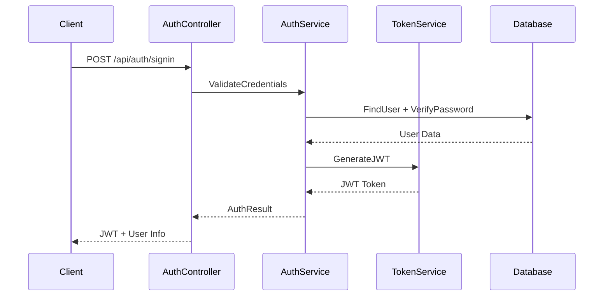

# 🏗️ Architecture & Technical Overview

## System Architecture

PlaySpace.Api follows **Clean Architecture** principles with clear separation of concerns across four main layers:

```
┌─────────────────────────────────────────────────────────────┐
│                        Presentation Layer                   │
│  ┌─────────────────┐  ┌─────────────────┐  ┌─────────────┐ │
│  │   Controllers   │  │   Middleware    │  │   DTOs      │ │
│  └─────────────────┘  └─────────────────┘  └─────────────┘ │
└─────────────────────────────────────────────────────────────┘
                                │
┌─────────────────────────────────────────────────────────────┐
│                      Application Layer                      │
│  ┌─────────────────┐  ┌─────────────────┐  ┌─────────────┐ │
│  │    Services     │  │   Interfaces    │  │  Validators │ │
│  └─────────────────┘  └─────────────────┘  └─────────────┘ │
└─────────────────────────────────────────────────────────────┘
                                │
┌─────────────────────────────────────────────────────────────┐
│                      Infrastructure Layer                   │
│  ┌─────────────────┐  ┌─────────────────┐  ┌─────────────┐ │
│  │  Repositories   │  │   DbContext     │  │  External   │ │
│  │                 │  │                 │  │  Services   │ │
│  └─────────────────┘  └─────────────────┘  └─────────────┘ │
└─────────────────────────────────────────────────────────────┘
                                │
┌─────────────────────────────────────────────────────────────┐
│                         Domain Layer                        │
│  ┌─────────────────┐  ┌─────────────────┐  ┌─────────────┐ │
│  │    Entities     │  │  Value Objects  │  │   Enums     │ │
│  └─────────────────┘  └─────────────────┘  └─────────────┘ │
└─────────────────────────────────────────────────────────────┘
```

## 📁 Project Structure

| Project | Responsibility | Key Components |
|---------|----------------|----------------|
| **PlaySpace.Api** | API Controllers & Configuration | Controllers, Program.cs, Middleware |
| **PlaySpace.Application** | Business Logic & Services | Services, Interfaces, Business Rules |
| **PlaySpace.Repositories** | Data Access Layer | Repositories, DbContext, Migrations |
| **PlaySpace.Domain** | Domain Models & Entities | Models, DTOs, Configuration |

## 🛠️ Technology Stack

### Core Framework
- **.NET 8.0** - Latest LTS version with performance improvements
- **ASP.NET Core Web API** - RESTful API framework
- **Entity Framework Core 9.0.8** - ORM for database operations

### Database
- **PostgreSQL** - Primary database
- **Entity Framework Migrations** - Database versioning
- **Connection Pooling** - Optimized database connections

### Authentication & Security
- **JWT Bearer Tokens** - Stateless authentication
- **BCrypt.Net** - Password hashing
- **CORS Policy** - Cross-origin resource sharing
- **Symmetric Key Validation** - Token validation

### Infrastructure
- **Docker** - Containerization with multi-stage builds
- **GitHub Actions** - CI/CD pipeline
- **OVH Cloud** - Production hosting
- **Swagger/OpenAPI** - API documentation

## 🔧 Key Design Patterns

### Dependency Injection
```csharp
// Service Registration Pattern
services.AddScoped<IUserService, UserService>();
services.AddScoped<IUserRepository, UserRepository>();
```

### Repository Pattern
- **Interface Segregation**: Each entity has its own repository interface
- **Generic Repository**: Common CRUD operations abstracted
- **Unit of Work**: Transaction management across repositories

### Service Layer Pattern
- **Business Logic Isolation**: Services handle business rules
- **DTO Mapping**: Data transfer objects for API contracts
- **Validation**: Input validation and business rule enforcement

## 📊 Database Schema Overview

### Core Entities
| Entity | Purpose | Key Relationships |
|--------|---------|-------------------|
| **User** | User accounts & profiles | → UserRoles, Reservations, Reviews |
| **Facility** | Sports facilities | → Courts, TimeSlots, BusinessProfile |
| **Reservation** | Booking records | → User, TimeSlot, Payment |
| **TimeSlot** | Available booking times | → Facility, Reservations |
| **Payment** | Transaction records | → Reservation, User |
| **TrainerProfile** | Trainer information | → User, Trainings |
| **BusinessProfile** | Business owner details | → User, Facilities |

### Relationship Types
- **One-to-Many**: User → Reservations, Facility → Courts
- **Many-to-Many**: User ↔ Roles (via UserRoles)
- **One-to-One**: User ↔ TrainerProfile, User ↔ BusinessProfile

## 🔐 Authentication Flow



## 🚀 Deployment Architecture

### Production Environment
```
┌─────────────────┐    ┌─────────────────┐    ┌─────────────────┐
│   GitHub Repo   │    │  GitHub Actions │    │   OVH Cloud     │
│                 │───▶│                 │───▶│                 │
│   master branch │    │   Build & Deploy│    │  Docker:7125    │
└─────────────────┘    └─────────────────┘    └─────────────────┘
                                                        │
                                               ┌─────────────────┐
                                               │   PostgreSQL    │
                                               │ host.docker.int │
                                               └─────────────────┘
```

### Container Configuration
- **Base Image**: mcr.microsoft.com/dotnet/aspnet:8.0
- **Exposed Port**: 7125 (internal) → 83 (external)
- **Environment**: Production settings
- **Database**: host.docker.internal PostgreSQL connection

## ⚡ Performance Considerations

### API Performance
- **Response Time Target**: <200ms average
- **Connection Pooling**: Optimized database connections
- **Async/Await**: Non-blocking operations throughout
- **DTO Optimization**: Minimal data transfer

### Scalability
- **Stateless Design**: JWT tokens enable horizontal scaling
- **Repository Pattern**: Easy to implement caching layer
- **Service Abstraction**: Microservices migration ready
- **Docker Ready**: Container orchestration support

## 🔍 Monitoring & Observability

### Health Checks
- **Endpoint**: `/api/health`
- **Database Connectivity**: Connection validation
- **Service Status**: Application health monitoring

### Logging Strategy
- **Structured Logging**: JSON formatted logs
- **Error Handling**: Global exception middleware
- **Audit Trail**: User action logging
- **Performance Metrics**: Request/response timing

## 🛡️ Security Measures

### Authentication Security
- **JWT Expiration**: Configurable token lifetime
- **Password Policy**: BCrypt hashing with salt
- **CORS Configuration**: Controlled cross-origin access

### Data Protection
- **SQL Injection**: EF Core parameterized queries
- **Input Validation**: Model validation attributes
- **File Upload**: 100MB limit with type validation
- **Secrets Management**: Configuration-based secrets

---

> **For Developers**: See Development Workflow for setup instructions
> **For Testers**: Review Testing Documentation for environment setup
> **For BAs**: Check Business Features for functional requirements